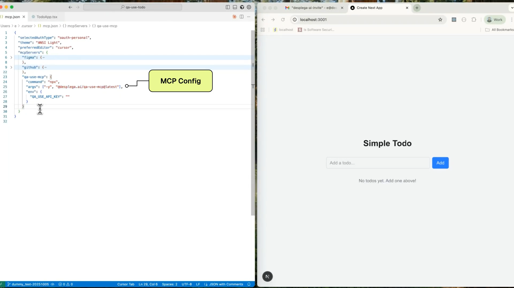

# qa-use

QA automation CLI for browser testing and E2E test management.

[](https://www.npmjs.com/package/@desplega.ai/qa-use)
[](https://opensource.org/licenses/MIT)

[](https://www.youtube.com/watch?v=ts3XsYneiO4)

## Quick Start

```bash
# Install globally
npm install -g @desplega.ai/qa-use

# Or use with npx
npx @desplega.ai/qa-use setup
```

## Getting Started

### 1. Setup

```bash
qa-use setup                    # Configure your API key
qa-use test init                # Initialize test directory with example
```

### 2. Create Your First Test

Create `qa-tests/login.yaml`:

```yaml
name: Login Test
app_config: your-app-config-id
steps:
  - action: goto
    url: /login
  - action: fill
    target: email input
    value: test@example.com
  - action: click
    target: login button
  - action: to_be_visible
    target: dashboard
```

### 3. Run Tests

```bash
qa-use test run login           # Run single test
qa-use test run --all           # Run all tests
```

## CLI Reference

### Test Commands

| Command | Description |
|---------|-------------|
| `qa-use test init` | Initialize test directory with example |
| `qa-use test run <name>` | Run a test by name |
| `qa-use test run --all` | Run all tests in `qa-tests/` |
| `qa-use test list` | List local tests |
| `qa-use test list --cloud` | List cloud tests |
| `qa-use test validate <name>` | Validate test syntax |
| `qa-use test sync --push` | Push local tests to cloud |
| `qa-use test sync --pull` | Pull cloud tests to local |
| `qa-use test export <id>` | Export cloud test to local file |

Run `qa-use test --help` for all options.

### Browser Commands

Interactive browser control for test development and debugging:

```bash
qa-use browser create                  # Start browser session
qa-use browser goto https://example.com
qa-use browser snapshot                # Get element refs like [ref=e3]
qa-use browser click e3                # Click by element ref
qa-use browser fill e5 "hello"         # Fill input field
qa-use browser run                     # Interactive REPL mode
```

| Command | Description |
|---------|-------------|
| `qa-use browser create` | Start browser session |
| `qa-use browser goto <url>` | Navigate to URL |
| `qa-use browser snapshot` | Get page element refs |
| `qa-use browser click <ref>` | Click element by ref |
| `qa-use browser fill <ref> <value>` | Fill input field |
| `qa-use browser screenshot <path>` | Save screenshot |
| `qa-use browser run` | Interactive REPL mode |
| `qa-use browser close` | Close browser session |

Run `qa-use browser --help` for the full list of 29 browser commands.

### Setup Commands

| Command | Description |
|---------|-------------|
| `qa-use setup` | Interactive configuration (API key, base URL, etc.) |
| `qa-use info` | Show current configuration |
| `qa-use install-deps` | Install Playwright browsers |

## Test Definition Format

Tests are YAML files with steps that describe user interactions:

```yaml
name: Checkout Flow
app_config: your-app-id
variables:
  email: test@example.com
depends_on: login-test          # Optional dependency
steps:
  - action: goto
    url: /cart
  - action: click
    target: checkout button
  - action: fill
    target: email input
    value: $email
  - action: to_be_visible
    target: order confirmation
```

**Supported actions:**

| Category | Actions |
|----------|---------|
| Navigation | `goto`, `go_back`, `go_forward`, `reload` |
| Input | `fill`, `type`, `click`, `hover`, `press`, `check`, `uncheck`, `select_option` |
| Waiting | `wait_for_selector`, `wait_for_timeout`, `wait_for_load_state` |
| Assertions | `to_be_visible`, `to_have_text`, `to_have_url`, `to_contain_text`, `to_be_checked` |
| Advanced | `ai_action`, `ai_assertion`, `extract_structured_data` |

See [SETUP.md](./SETUP.md) for the complete test definition guide.

## Configuration

### Environment Variables

```bash
QA_USE_API_KEY=xxx              # Required: Your desplega.ai API key
QA_USE_REGION=us                # Optional: "us" or "auto" (default)
```

### Config File

Alternatively, use `~/.qa-use.json`:

```json
{
  "env": {
    "QA_USE_API_KEY": "your-api-key-here",
    "QA_USE_REGION": "us"
  }
}
```

Environment variables take precedence over the config file.

## CI/CD Integration

### Basic GitHub Actions

```yaml
# .github/workflows/e2e.yml
name: E2E Tests

on: [push, pull_request]

jobs:
  e2e:
    runs-on: ubuntu-latest
    steps:
      - uses: actions/checkout@v4
      - uses: actions/setup-node@v4
        with:
          node-version: '20'

      - name: Run E2E Tests
        env:
          QA_USE_API_KEY: ${{ secrets.QA_USE_API_KEY }}
        run: |
          npm install -g @desplega.ai/qa-use
          qa-use test run --all --download

      - name: Upload Results
        if: always()
        uses: actions/upload-artifact@v4
        with:
          name: e2e-results
          path: /tmp/qa-use/downloads/
```

### PR Verification with Claude Code

Use the qa-use plugin with Claude Code to automatically verify PRs:

```bash
# Install the qa-use plugin
claude plugin install @desplega.ai/qa-use

# Verify a feature works
/qa-use:verify "the login form accepts valid credentials"

# Verify PR changes
/qa-use:verify-pr
```

See [SETUP.md](./SETUP.md) for advanced CI workflows including AI-assisted test generation.

## Claude Code Plugin

qa-use includes a Claude Code plugin for AI-assisted testing workflows:

```bash
# Install the plugin
claude plugin install @desplega.ai/qa-use
```

**Available skills:**

| Skill | Description |
|-------|-------------|
| `/qa-use:verify <description>` | Verify a feature works through browser automation |
| `/qa-use:verify-pr` | Verify PR changes with automated browser testing |
| `/qa-use:explore` | Explore a web page interactively |
| `/qa-use:record` | Record browser actions into a test definition |
| `/qa-use:test-run` | Run E2E tests |
| `/qa-use:test-validate` | Validate test syntax |

## MCP Server

For AI assistant integration (Claude Desktop, VS Code Copilot, Cursor, etc.), qa-use includes an MCP server with full browser automation capabilities.

```bash
qa-use mcp                      # Start stdio server (default)
qa-use mcp --http               # Start HTTP/SSE server
qa-use mcp tunnel               # Start persistent tunnel mode
```

See [MCP.md](./MCP.md) for complete MCP server documentation including:
- Client configurations for all major AI assistants
- HTTP transport mode for web integrations
- Tunnel mode for backend-initiated testing
- Full MCP tools reference

## Development

```bash
git clone https://github.com/desplega-ai/qa-use.git
cd qa-use
bun install
bun run build
bun run dev
```

> **Note:** This project uses **bun** as the package manager.

See [CONTRIBUTING.md](./CONTRIBUTING.md) for development guidelines.

## Documentation

- [SETUP.md](./SETUP.md) - Complete E2E test setup guide
- [MCP.md](./MCP.md) - MCP server documentation
- [CONTRIBUTING.md](./CONTRIBUTING.md) - Development guide
- [CLAUDE.md](./CLAUDE.md) - AI assistant onboarding

## License

MIT
